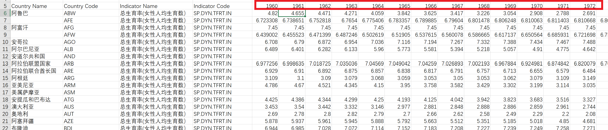
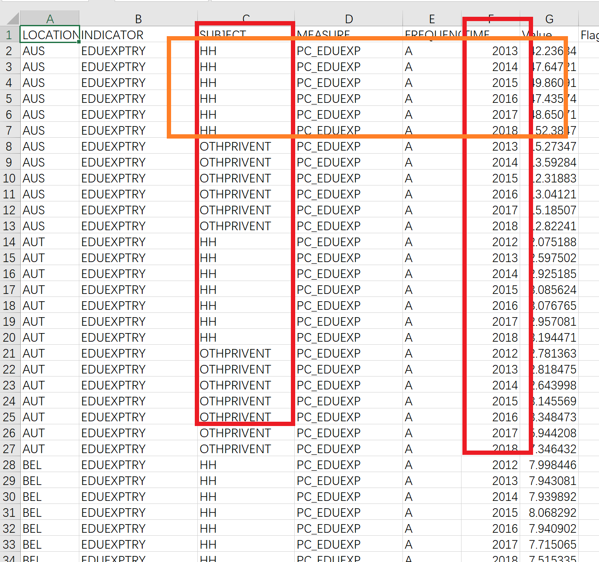

# Data Process Helper

说明: 本程序主要处理像`美赛F题`那样需要世界范围国家多个指标数据的题目

## 主要功能

- 整合多张数据表, 获得整合表格数据(每项指标可采取`平均`，`求和`等不同操作)
- 保留中间处理得到的可能有用的数据(生成表格)
- 生成热力图 (提供多个可供选择)

## 注意事项

- 请将`main.py`和`datas`、`result`目录放在一起，将需要处理的数据文件放在`datas`目录下。
在数据表中结果数据要为`数字`形式,像`200M`,`300K`这种的数据需要先进行处理(`python pandas` 或 `Excel替换功能` 都是不错的选择)

- `重要`: 在使用程序前务必将表格中不要的行和列删除

## 设置数据文件属性

## 所有属性

1.  `dataFileType`: `time-expand`,`time-in-column`,`complex` 默认值 `time-expand`

- `time-expand`:

- `time-in-column`:
注意只有总共只有三列变化(如`LOCATION`和`TIME`和`Value`,因变量只有两个变化`LOCATION`和`TIME`)

- `complex`:

比`time-in-column`多一层复杂度,也就是有四列变化, 这种数据此程序会提供按`SUBJECT`提取数据(然后按时间求和或者平均)以及在此基础上合并`SUBJECT`指标(像求和或者平均等操作)

2. `subjectColumnName`: `$columnName`

若`dataFileType`为`complex`则需要设置此属性:
`$columnName` 就是列名,比如输入`subject` (ps: 如果列名有重复，请按参考以下: `subject`,`subject.1`,`subject.2`,分别为第一个，第二个，第三个)

3. `timeColumnName`: `$columnName`

若`dataFileType`为`time-in-column`则需要设置此属性:

4. `countryColumnName`: `$columnName` 

5. `theme`: `$themeName` 默认为 `文件名`

`theme`指关于表研究的主题, 如绘制关系图时候将会使用这个作为标签

