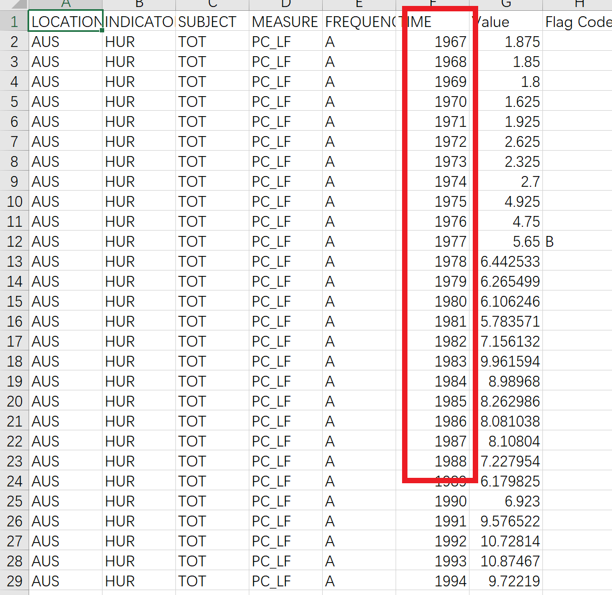

# Data Process Helper

## 注意事项
请将`main.py`和`datas`、`result`目录放在一起，将需要处理的数据文件放在`datas`目录下。


## 设置数据文件属性

## 所有属性

- `dataFileType`: `time-expand`,`time-in-column` 默认值 `time-expand`

`time-expand`:


`time-in-column`:


- `timeColumnName`: `$columnName`
根据`dataFileType`设置此属性为不同的值:
    - `time-expand`: `None` (直接回车即可,不要打`None`)
    - `time-in-column`: `$columnName` (ps: 如果列名有重复，请按参考以下: `a`,`a.1`,`a.2`)

### 示例

#### World Bank 获取的文件设置


```python

```

