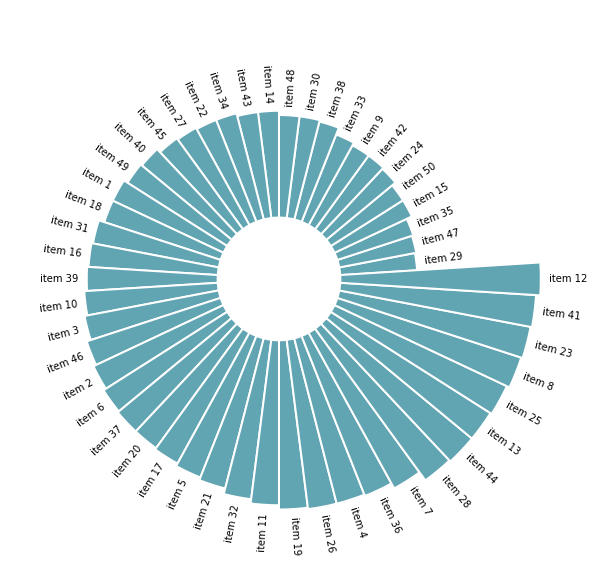
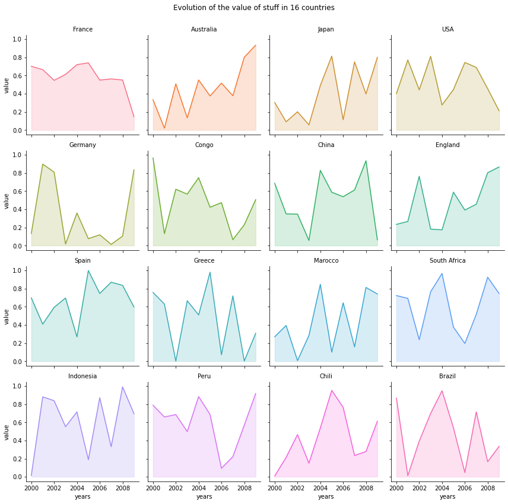
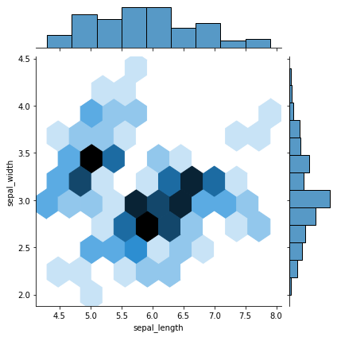
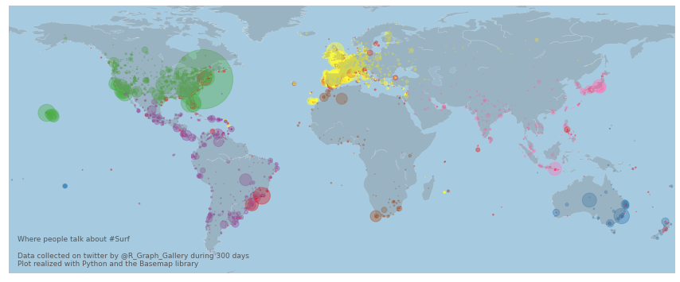
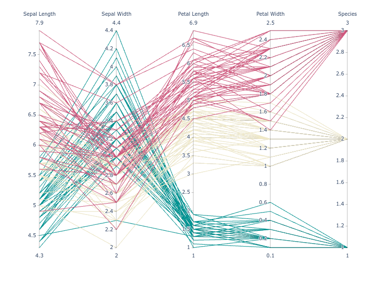
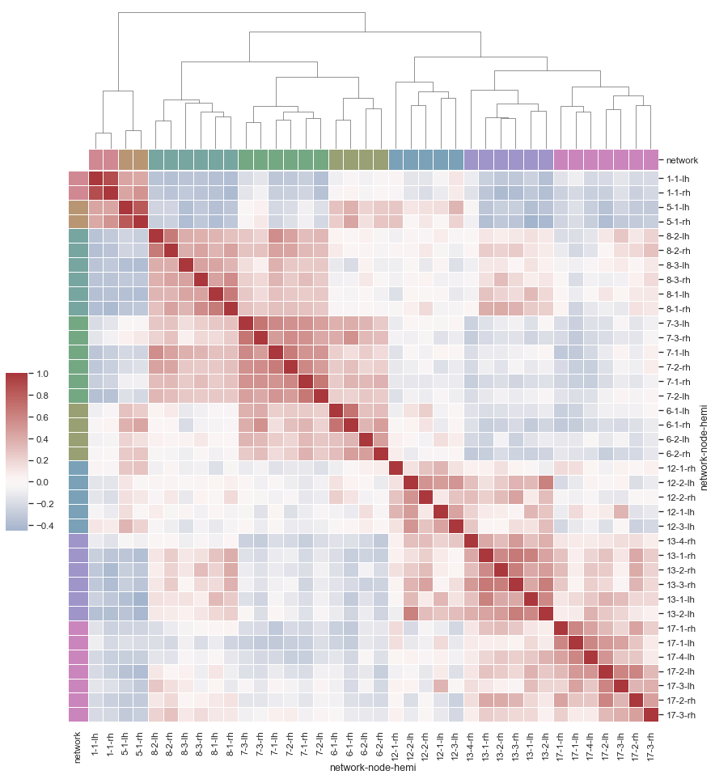

# 说明
一些可能会用到的图,其中`myArt`文件夹下是我自己设计的图

## 参考

1. [All Charts](https://www.python-graph-gallery.com/all-charts/)
2. [Seaborn Example](https://seaborn.pydata.org/examples/index.html)
3. [Matplotlib Example](https://matplotlib.org/stable/gallery/index.html)

## 其他的一些可能会用到的图
点击图片跳转(需要安装浏览器插件`link to text fragment`(谷歌官方发布的插件))

要使用下面这张图的代码需要安装`mpl_toolkits`里的`basemap`  
`matplotlib`的`basemap`很坑，会遇到各种报错,总之这里给出通用安装方法
步骤:
    1. `conda`创建`python3.6`的环境，然后再`conda install basemap`
    2. 然后将`matplotlib`降级至`3.2`,命令`pip install -U matplotlib==3.2`

下面这个就是结合起来图有点大

