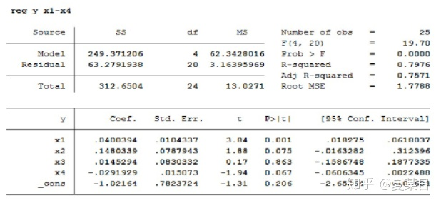
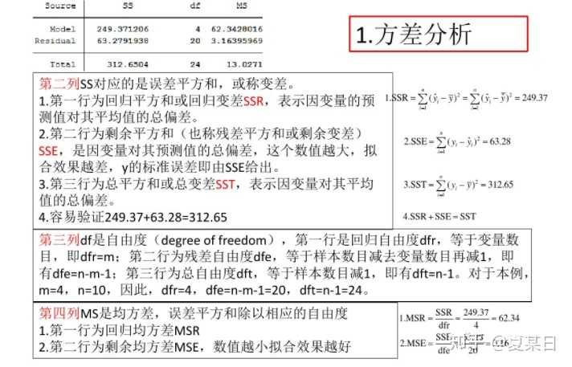
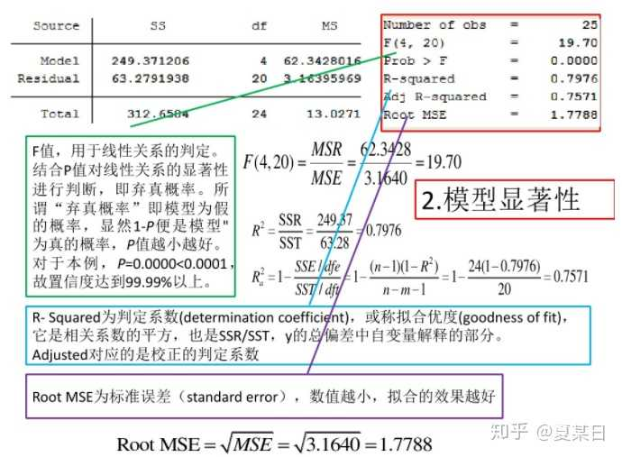
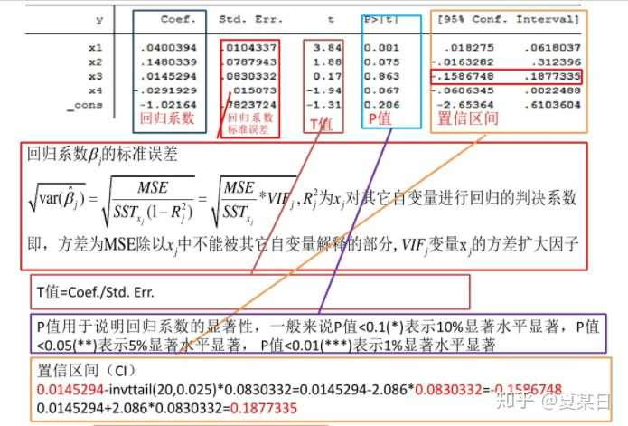
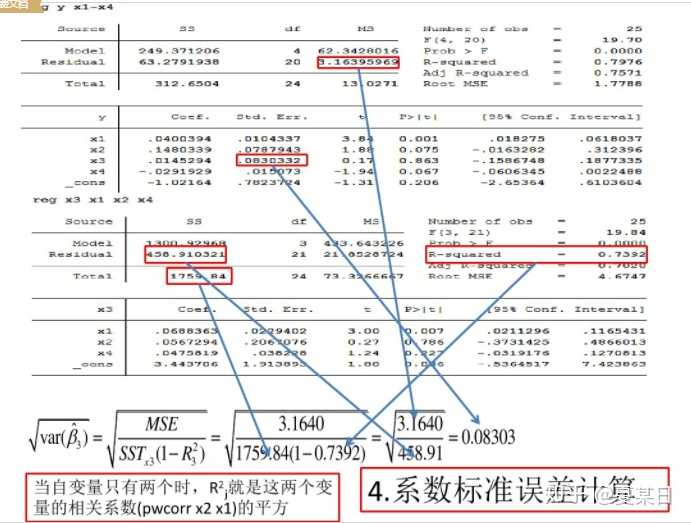

# Tips

这篇文章`simpread-用 python 做多元线性回归 方法总结.html`里总结了很多中方法,至于其中说的有些方法只能有一个因变量`y`，现在不一定成立，毕竟库的版本在更新。  

个人建议使用`statsmodels`来分析(可以对字符串型数据自动建立虚拟变量)。

## 结果分析
以软件`Stata`得出的结果为例,`statsmodels`结果也能看懂。

- [视频](https://www.bilibili.com/video/BV1U54y1R7iL/)
- 图片:

