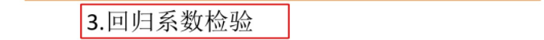

# Tips

这篇文章`simpread-用 python 做多元线性回归 方法总结.html`里总结了很多中方法,至于其中说的有些方法只能有一个因变量`y`，现在不一定成立，毕竟库的版本在更新。  

个人建议使用`statsmodels`来分析(可以对字符串型数据自动建立虚拟变量，如需指定可看[这里](https://www.statsmodels.org/dev/examples/notebooks/generated/ols.html#OLS-with-dummy-variables))。有关`stata`和`statsmodels`的用法比较在`simpread-Comparing Stata and Ipython Commands for OLS Models  Rob Hicks.html`一文中

1. 线性模型不一定只是说$y = \beta_{0} + \beta_{1} x + \mu $，也可以是以下(只要把另外看成新的变量即可):  
- $y = \beta_{0} + \beta_{1} x_{1} + \beta_{2} x_{2} + \beta_{2} (x_{2})^2  + \mu $  
- $y = \beta_{0} + \beta_{1} x_{1} + \beta_{2} x_{1} x_{2}  + \mu $
- $y = \beta_{0} + \beta_{1} ln x_{1}  + \mu $
- $ln y = \beta_{0} + \beta_{1} ln x_{1}  + \mu $

对几种情况的解释:  
- 对于一般情况,也就是$y = \beta_{0} + \beta_{1} x + \mu $, $\beta_{0}$表示当$x=0$时的`y`值,$\beta_{1}$表示$x$每增加一单位,$y$增加$\beta$
- 有$x_{1} x_{2}$这种的，比如说$y$为房价，$x_{1}$为占地面积, $x_{2}$为房间数量, 他们乘机与`y`间有关系。(只要解释得同就行)
- 对于$x$一边是$ln$的,表示$x$每增加`1%`,$y$平均变化$b/100$个单位
- 对于$y$一边是$ln$的,表示$x$每增加1单位,$y$平均变化`(100b)%`个单位
- 对于两边都是$ln$的,表示$x$每增加`1%`,y平均变化`b%`。

2. 为了更为精准的研究影响评价量的重要因素（去除量纲的影响），我们可考虑使用`标准化回归系数`(就是使用广义最小二乘`gls`)
> 标准化系数的绝对值越大，说明对因变量的影响就越大（只关注显著的回归系数哦）
> 然而

3. 不要对数据进行归一化处理。归一化处理使参数范围变化，接着导致计算出的系数数值可能与实际不符

4. 置信区间最好不要包含0,因为`t`的原假设`H0`就是$\beta$为`0`
```shell
                  coef    std err          t      P>|t|      [0.025      0.975]
-------------------------------------------------------------------------------
Intercept      38.6517      9.456      4.087      0.000      19.826      57.478
Region[T.E]   -15.4278      9.727     -1.586      0.117     -34.793       3.938
Region[T.N]   -10.0170      9.260     -1.082      0.283     -28.453       8.419
Region[T.S]    -4.5483      7.279     -0.625      0.534     -19.039       9.943
Region[T.W]   -10.0913      7.196     -1.402      0.165     -24.418       4.235
Literacy       -0.1858      0.210     -0.886      0.378      -0.603       0.232
Wealth          0.4515      0.103      4.390      0.000       0.247       0.656
```

5. 对于`异方差`,相对于`bp检验`,推荐使用`怀特检验`(两者`原假设`都是`不存在异方差`)。**解决异方差**:  
    1. 使用`ols`+`稳健的标准误`(推荐，大多数情况下应该用这个)，写到论文中可以写上`According to Stock and Watson(2011)`
    2. `广义最小二乘法`(`gls`)
    

6. 对于`多重共线性`:
   见下图，在调包(`statsmodels`的`smf`或`pasty`的`dmatrices`)的时候`R`型公式也会帮我们自动自动删去多余的解释变量(比如字符串型变成一类一类，取出一个作为对照),避免了`严格多重共线性`。`近似多重共线性`的症状还是要看下下图打框处。当然也可以通过`vif`值来检测多重共线性($vif_{m}$越大,说明第$m$个变量和其它变量的相关性越强。一个经验规则是:如果$vif>10$，则认为该回归方程存在严重的多重共线性)
   
   处理:
   
   第三点`增大容量`(增加变量)可能不现实,一般还是删除(`逐步回归法`可以实现剔除`多重共线性`影响)  
   补充: `主成分分析`也是处理`多重共线性`的好方法

7. `逐步回归法`注意点:
   1. 不要轻易使用`逐步回归分析`,因为剔除变量后可能会产生如`内生性`的问题(不过数模没有那么严格;而`经济学`类的期刊要考虑周到)
   2. 现在一般选择`向后逐步回归`
   3. 更优秀的方法: 将每种变量组合都试一遍(不过计算量太大，如$k$个变量,有$2^{k}-1$种可能)

## 结果分析
以软件`Stata`得出的结果为例,`statsmodels`结果也能看懂。

- [视频](https://www.bilibili.com/video/BV1U54y1R7iL/)
- 图片:





