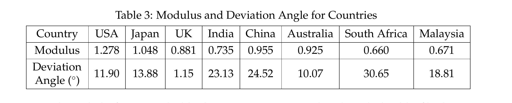

# O奖论文心得(F题)

里面也包含了自己的一些想法

- [O奖论文心得(F题)](#o奖论文心得f题)
  - [关于权重的表示方法](#关于权重的表示方法)
    - [I](#i)
    - [II](#ii)
  - [展示选择的国家](#展示选择的国家)
  - [综合评价图表](#综合评价图表)
    - [单显示指标](#单显示指标)
      - [3D表示(3指标)](#3d表示3指标)
      - [2D表示(2指标)](#2d表示2指标)
      - [其他情况(多指标)](#其他情况多指标)
    - [算上结果](#算上结果)
  - [关于凑字数的方法](#关于凑字数的方法)
    - [Assumption](#assumption)

## 关于权重的表示方法

### I
说明: `SD`,`ST`,`SI`是大方面，第二层次可以这样表达，至于表达大方面的权重，可以在图片标题里写

### II
一次性展示所有

## 展示选择的国家

是否要提及所选，但是若是要，可以使用地图

## 综合评价图表

### 单显示指标

就是得分不在图上

#### 3D表示(3指标)
理想状态是三个大指标都是1

#### 2D表示(2指标)

#### 其他情况(多指标)

如果是多于三个指标，若是就比较`两个国家`或`一个国家不同年份`，可以考虑使用雷达图

### 算上结果

`想法`:如果是只有两个方面的可以做成3D图，z轴代表成绩，类似棒棒糖，糖果头表示数据点，细细的糖果棒垂直于xy平面，指明xy坐标，用不同颜色+`legend`来表示不同国家。

## 关于凑字数的方法

### Assumption

 (来自2021美赛E题)
