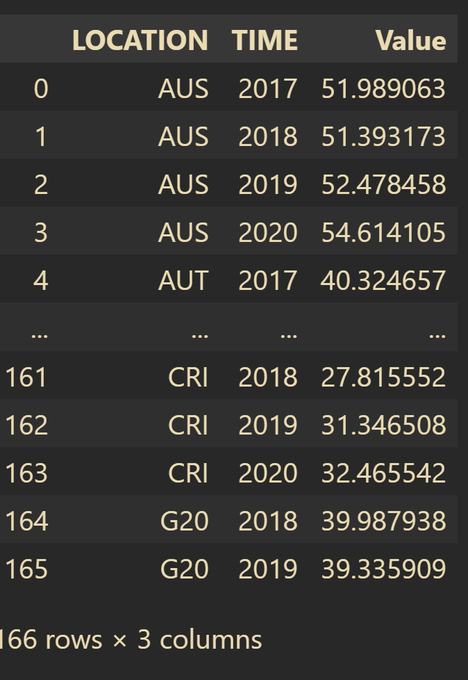
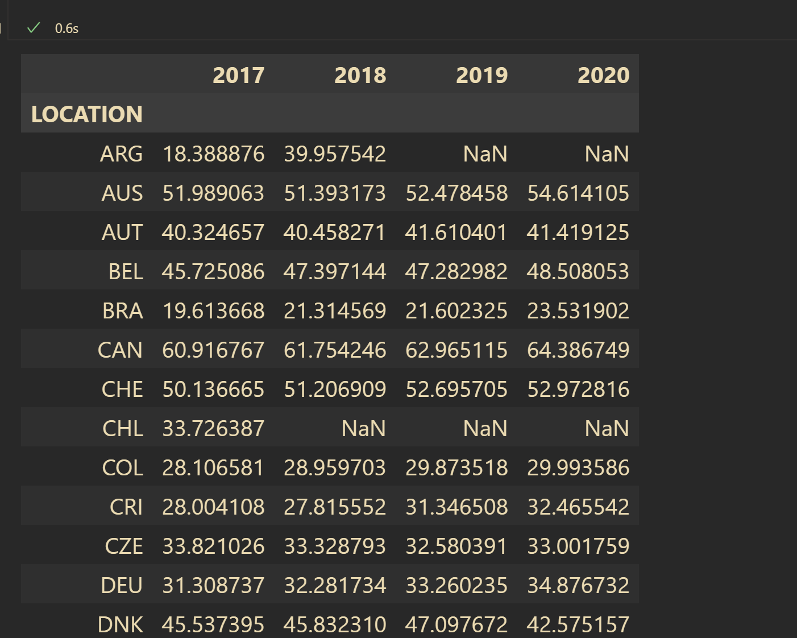

# Pandas Notes


## 公共键

```python
# 注意list
sharedKeys = [key for key in df["Country"] if key in list(df["Country"])]
```

## 查找重复行

### 检测重复行

```python
dframe.duplicated()
```

### 删除重复行

```python
#删除重复行，该函数返回的是删除重复行后的DataFrame对象
dframe.drop_duplicates()
```

### 仅返回index
```python
df = df[df.duplicated(keep=False)]

df = df.groupby(df.columns.tolist()).apply(lambda x: tuple(x.index)).tolist()
print (df)
# [(1, 6), (2, 4), (3, 5)]
```

### 看到重复行的值 + index

```python
df1 = (df.groupby(df.columns.tolist())
       .apply(lambda x: tuple(x.index))
       .reset_index(name='idx'))
print (df1)

#    param_a  param_b  param_c     idx
# 0        0        0        0  (1, 6)
# 1        0        2        1  (2, 4)
# 2        2        1        1  (3, 5)
```


## 展开一行的值(一行生成多行)




```python
df.pivot("LOCATION","TIME","Value").rename_axis(columns=None)
```

